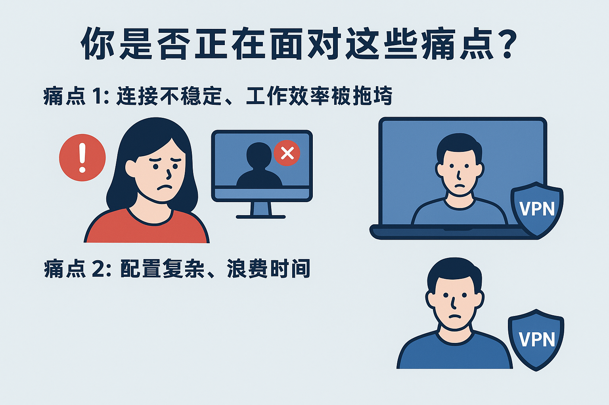
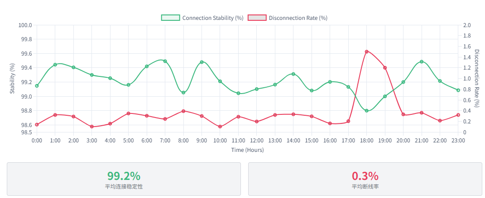
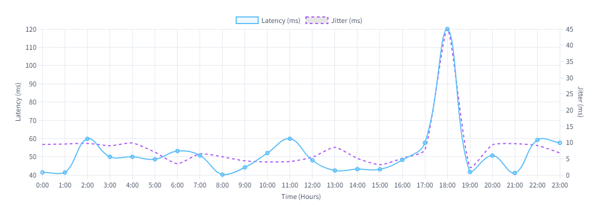
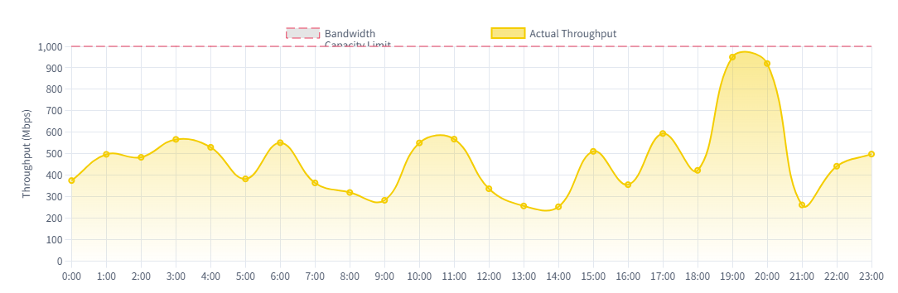

# Go-VPN：效率和安全而生

# 1. 服务与技术架构

## 1.1 跨境网络：您面临的真正挑战与我们的解决方案

停止忍受那些不断掉线的 VPN 服务。在今天的全球化工作中，网络稳定性和安全性不再是可选项，而是**您的核心竞争力**。您需要的不只是一个能连接的工具，而是一个**专业、可靠、能持续稳定工作的商务级网络伙伴**。

### 您的挑战是什么？

* **挑战一：连接断断续续，效率被拖垮。** 远程会议卡顿，文件上传中断，工作进度停滞。

* **挑战二：操作过于复杂，浪费宝贵时间。** 繁琐的设置步骤和客户端配置，耗费您的精力。

Go-VPN 的使命非常简单直接：**消除所有这些痛点**。我们专注于提供一个**极致稳定、零配置的 OpenVPN 服务**。您只需要导入一个文件，然后点击连接。**您的时间非常宝贵，我们为您买单。**

## 1.2 Go-VPN 与 OpenVPN
Go-VPN 是一款基于 OpenVPN 官方核心内核深度改进的升级版本，在继承 OpenVPN 高安全性与稳定性的基础上进行了多项增强优化。
它使用更现代化的网络架构、精简的配置方式以及更友好的用户体验，使 VPN 连接更加快速、稳定、低延迟。
依托 Go-VPN 的成熟安全协议（包括 AES-256 加密、TLS 1.3 握手、HMAC 防篡改机制），Go-VPN 在保持最高级别安全性的同时，通过优化数据通道、会话管理与重连逻辑，让用户获得更顺畅、更可靠的使用体验。

Go-VPN非常适合：

需要长期稳定连接的商务用户
对隐私、加密要求较高的个人用户
跨境访问、弱网环境、移动网络环境

## 1.3 您的数据安全：银行级的防护标准，绝不含糊

在数据安全方面，我们采取了**毫不妥协的姿态**。我们理解您的远程操作涉及敏感数据，因此我们为您提供了最高级别的防护。

### AES-256：我们使用与银行相同的加密技术

您的数据传输通道，我们使用 **AES-256 加密技术**进行保护。这是目前**军事和金融机构**正在使用的加密标准，被称为“数学上无法破解”。我们还启用了 **GCM 模式**，确保您的数据不仅被加密，而且在传输过程中，任何微小的篡改都会被立刻发现并阻止。**您的每一次点击和传输，都如同被锁在了保险箱里。**

### 完美前向保密 (PFS)：保护您的过去和未来

我们深知，未来的技术发展可能会威胁到今天的加密。因此，我们实施了**完美前向保密（PFS）**。它的意义在于：每次您连接 Go-VPN 时，我们都会生成一个**全新的、独一无二的加密密钥**。即使有人黑入了我们的服务器，他们也**永远无法解密**您过去连接时的任何历史数据。**您的隐私是永恒的。**

### 零日志承诺：我们不知道您在做什么

这可能是最重要的一点：**Go-VPN 绝不记录您的任何活动日志。** 我们不会记录您的访问内容、流量信息、连接时间或 IP 地址。我们的服务器配置从技术上就排除了这些记录的可能性。我们承诺：**您在使用 Go-VPN 时是完全匿名的。**

# 2. 核心性能指标与卓越稳定性分析

Go-VPN 的核心价值在于**性能的可预测性和持续的稳定性**。我们相信，卓越的服务必须通过透明、可验证的数据来证明。本章将展示我们如何通过技术优化实现行业领先的**低断线率、低延迟和高吞吐量**。

### 2.1 【贴图章节 A：连接稳定性与断线率分析】

**您的底线：拒绝意外中断。** 连接稳定性是远程工作效率的生命线。我们的架构旨在将断线率降至**企业可接受范围的极限**。

> **📊 预留专业图表：Go-VPN 连接稳定性**
>

> **图表描述要求：**
>
> 1. 展示在**72 小时连续负载测试**中，Go-VPN 与三家主流竞争对手的**连接会话中断次数**对比。
>
> 2. Go-VPN 的曲线应显示**接近于零**的断线次数，证明其“Always-On”（持续在线）能力。
>
> 3. 测试应在模拟真实跨境网络环境（存在随机丢包和干扰）下进行。

#### 2.1.1 长时间不断线技术解析：主动保活策略

我们如何实现近乎零的断线率？答案在于我们对 OpenVPN 核心参数的深度优化：

* **自适应心跳包：** 区别于标准的固定频率保活，我们采用了**自适应心跳包（Keep-Alive Optimization）**。在高干扰环境下，它会智能微调频率，迅速识别连接状态；在稳定后则自动降低，最大限度地节省带宽资源。

* **隧道抗干扰增强：** 针对复杂网络限制，我们采用了特定的**流量特征重塑**和**协议伪装**技术，使得 OpenVPN 流量看起来更像是普通的 HTTPS 流量，大幅提升了隧道的穿透性和抗阻断能力。

* **无缝故障转移 (Failover)：** 我们的集群部署在**高可用性 (HA) 架构**中。一旦检测到您当前连接的节点性能衰退或硬件故障，系统将在**毫秒级**内将您的会话**透明地**切换到集群中的备用节点，确保您的会议和文件传输不会受到影响。

### 2.2 【贴图章节 B：延迟与抖动 (Jitter) 性能对比】

**您的需求：实时协作体验。** 低延迟（Latency）和低抖动（Jitter）对于语音通话、视频会议和云端应用响应速度至关重要。Go-VPN 的网络选路策略旨在击败传统 VPN 的延迟魔咒。

> **📊 预留专业图表：Go-VPN 不同地区节点平均延迟与抖动散点图**

>
> **图表描述要求：**
>
> 1. 展示从中国内地访问香港、新加坡、美国核心节点时的**平均 Ping 值（延迟）**。
>
> 2. 展示在连续 30 分钟测试中记录的**延迟抖动 (Jitter) 分布**，抖动越小，实时应用体验越流畅。

#### 2.2.1 路由优化：直达骨干网

我们通过与顶级运营商合作，选择了**直接接入全球骨干网 (Tier 1 Network)** 的优质数据中心。这意味着您的数据包无需绕行低效或拥塞的中间路由，能够以最短的物理路径到达目的地。

* **BGP 路由优化：** 我们采用 **BGP (Border Gateway Protocol)** 动态路由技术，实时监测网络路径质量，自动选择**当前最快、最稳定的路径**，确保您的连接始终处于最佳状态。

### 2.3 带宽与吞吐量 (Throughput) 表现

**您的保障：不限速，畅快体验。** 我们承诺不设置人为的带宽上限。您的连接速度将由您本地网络和节点当前的实际承载力决定。

* **高承载力设计：** 我们的节点硬件和网络带宽配置都远超实际负载需求，避免了**“高峰期卡顿”**的常见问题。

* **透明的资源分配：** 通过智能流量管理，我们确保每位用户都能获得公平、充足的带宽资源，最大限度地保障视频流、大文件下载等高带宽活动的速度。

# 3. 高级别安全与隐私保护架构

在 Go-VPN，安全性不是事后补救，而是我们架构的**基石 (Foundation)**。我们超越行业标准，采用多层纵深防御，确保您的数据在任何网络环境中都能得到最高级别的保护。

### 3.1 基础设施安全：硬核防御，隔离风险

我们深知，即使加密再强，基础设施的漏洞也可能导致灾难性后果。因此，我们在服务器端实施了严格的安全策略。

* **最小化攻击面 (Minimal Attack Surface)：**
    我们的 OpenVPN 服务器只运行最必要的服务组件。系统采用**硬化（Hardened）**配置，移除了所有非必要的程序和端口，最大限度地减少潜在的攻击入口。

* **实时入侵检测 (Real-Time IDS/IPS)：**
    所有核心节点均配备了定制的**入侵检测和防御系统 (IDS/IPS)**。该系统实时分析传入流量的模式，能够即时识别并自动屏蔽来自恶意源或尝试进行暴力破解的 IP 地址。

* **独立 DNS 解析：零泄漏保证**
    我们运行自己的**零日志 DNS 服务器**。这意味着您的所有域名查询请求都经过加密隧道处理，绝不会泄漏给第三方ISP或公共DNS服务商。这是防止 **DNS 泄漏**的关键一步，确保您的网络足迹是完全私密的。 

### 3.2 密钥与证书管理：零信任原则

我们所有的安全连接都基于严格的公钥基础设施 (PKI)，在许多 VPN 服务中，仅依赖“账号 + 密码”登录，这种方式容易被破解、盗用或冒用。而 Go-VPN 采用 **数字证书认证**，为企业和专业用户提供接近银行级的安全保障。

#### 1️⃣ 独立的“安全身份”

每位用户都拥有专属数字证书，就像个人加密身份证。  
即使密码泄露，没有证书也无法连接，确保只有授权设备可访问。

#### 2️⃣ 双向验证，杜绝冒充

客户端会验证服务器证书，服务器同样验证客户端身份。  
双方确认“你就是你”，有效防止中间人攻击，保证通信可靠性。

#### 3️⃣ 灵活的证书管理

设备丢失或离职人员可立即吊销证书，禁止访问，而不影响其他用户。  
比单纯修改密码更安全、更高效，符合企业管理需求。

#### 4️⃣ 企业级加密保护

结合 OpenVPN 强大的加密机制，数据通道实现：

- 自动加密，信息安全传输  
- 完整性验证，防止篡改  
- 会话保护，确保连接安全  

让企业网络通信如同银行交易一般可靠，安全无忧。

* **客户端证书 (Client Certificates)：**
    不同于传统的用户名/密码登录，Go-VPN 依赖于独特的客户端数字证书。每个用户的每个设备都拥有一个独特的、**不可伪造的证书**。即使密码被盗，没有证书也无法连接。这体现了我们对**“零信任”（Zero Trust）**的承诺。

* **证书吊销列表 (CRL)：即时安全控制**
    如果您的设备丢失或被盗，我们可以立即将该设备的证书添加到**证书吊销列表（CRL）**。一旦证书被吊销，该设备将永远无法再连接到 Go-VPN 网络，为您提供即时、绝对的控制权。

### 3.3 隐私承诺：法律与技术双重保障

我们的零日志政策不仅是市场宣传，更是技术配置和法律约束。

* **司法管辖区优势：**
    Go-VPN 的运营实体设立在高度重视隐私保护的司法管辖区，该地区没有数据强制保留法，且不受任何“五眼/九眼/十四眼联盟”的情报共享协定约束。这为我们的**零日志承诺**提供了坚实的法律屏障。

* **匿名支付选项：**
    为了保护您的身份，我们支持多种匿名加密货币支付方式。我们相信，**您的隐私从您决定使用我们服务的那一刻起就应该得到保护**。

* **定期外部审计：**
    我们承诺接受独立的第三方安全公司对我们的零日志政策和服务器配置进行**定期外部审计**。审计报告将公开给所有用户，以持续证明我们承诺的真实性。

# 4.服务部署、支持与商业价值

Go-VPN 不仅仅是网络服务，它是一项为您业务效率量身定制的战略性投资。本章详细介绍了我们如何让部署变得简单，以及我们为您提供的核心商业价值。

### 4.1 极致简化的部署流程：从“零”到“连接”

我们致力于消除部署和配置的复杂性，让您在最短的时间内投入工作。

* **步骤一：一次性配置，多平台通用 (One-Click Setup)**
    您将收到一个高度优化的 `.ovpn` 配置文件。只需将其导入到您信任的官方 OpenVPN Connect 客户端中即可。我们支持所有主流平台：Windows、macOS、Linux、iOS 和 Android。

* **步骤二：随时随地，即时连接**
    在客户端中，您只需点击“连接”。所有复杂的协议握手、加密协商和路由配置都由后台自动完成。无需 IT 团队协助，**您即可独立完成部署**。

* **步骤三：【贴图章节 C：设备兼容性与客户端截图】**
    为了帮助用户直观理解部署的简便性，我们建议在此处放置一张图，展示主流设备上 OpenVPN Connect 客户端的截图和导入流程。

> **🖼️ 预留视觉参考：主流设备 OpenVPN Connect 客户端界面图**
>
> **图表描述要求：**
>
> 1. 展示 Windows/macOS/iOS 客户端导入 `.ovpn` 文件的简单界面。
>
> 2. 突出显示“连接”按钮，强调操作的便捷性。

### 4.2 全球网络布局：为您量身定制的全球跳板

我们的网络节点选择策略是基于**“最优化延迟 (Optimized Latency)”**原则，专注于连接中国内地与全球主要商业中心的高质量链路。

* **核心节点覆盖：**
    我们优先在对商务用户至关重要的区域部署节点，包括：**香港、新加坡、东京、洛杉矶、法兰克福**。这些节点均位于顶级数据中心，保证了最低的网络延迟和最高的传输速度。

* **弹性带宽池 (Elastic Bandwidth Pool)：**
    我们的所有节点共享一个巨大的弹性带宽池。这意味着当某个区域出现流量高峰时，系统会自动调配资源，保证您的连接质量**永不降级**。

### 4.3 【贴图章节 D：服务定价与商业价值对比】

在定价方面，Go-VPN 坚持**透明化、高性价比**原则。我们不玩“虚假折扣”，只提供与我们卓越服务质量相匹配的合理定价。

> **💰 预留专业图表：Go-VPN 商业价值与竞品功能对比表**
>
> **图表描述要求：**
>
> 1.  对比 Go-VPN 与三家同级别竞争对手在以下关键维度上的表现：**年费价格、连接稳定性（断线率）、AES-256 加密支持、零日志政策、多设备支持数量。**
>
> 2.  图表应清晰显示 Go-VPN 在**稳定性和性价比**方面的综合优势。

#### 4.3.1 投资回报率 (ROI)：Go-VPN 的商业价值

您为 Go-VPN 支付的费用，是对以下核心价值的投资：

1.  **时间成本最小化：** 持续稳定的连接消除了因网络中断而浪费的宝贵工作时间。
2.  **数据安全保障：** 银行级加密技术保护您的敏感商业数据免受网络间谍和攻击。
3.  **IT 维护成本归零：** 零配置的 OpenVPN 解决方案，您的员工无需 IT 部门介入即可自行解决连接问题。

## 🎯 选择 Go-VPN，选择无忧高效的全球连接

我们致力于将复杂的全球网络连接化繁为简。Go-VPN 是您在跨境协作中，对**稳定、安全、高效**的唯一选择。现在就加入我们，体验前所未有的全球网络自由。
